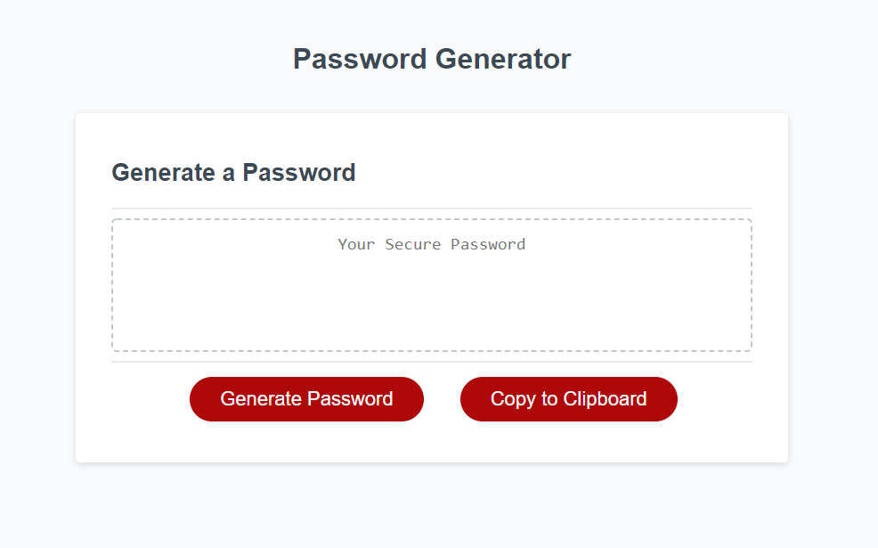
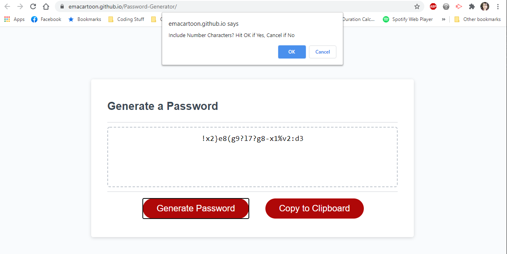

# Password-Generator

## Link

[https://emacartoon.github.io/Password-Generator/index.html](https://emacartoon.github.io/Password-Generator/index.html)

## Motivation / Project Criteria

**Source:** Bootcamp documentation and is © 2021 Trilogy Education Services, LLC, a 2U, Inc. brand. Confidential and Proprietary. All Rights Reserved.

AS AN employee with access to sensitive data, I WANT to randomly generate a password that meets certain security criteria SO THAT I can create a strong password to provide greater security.

GIVEN I need a new, secure password
WHEN I click the button to generate a password
[x] THEN I am presented with a series of prompts for password criteria
WHEN prompted for password criteria
[x] THEN I select which criteria to include in the password
WHEN prompted for the length of the password
[x] THEN I choose a length of at least 8 characters and no more than 128 characters
WHEN prompted for character types to include in the password
[x] THEN I choose lowercase, uppercase, numeric, and/or special characters
WHEN I answer each prompt
[x] THEN my input should be validated and at least one character type should be selected
WHEN all prompts are answered
[x] THEN a password is generated that matches the selected criteria
WHEN the password is generated
[x] THEN the password is either displayed in an alert or written to the page

## Approach

This project utilizes Javascript functions to generate the desired characters in an array as a more secure password, and then easily copy to clipboard.

## Technology Used

Javascript and a pre-generated CSS and HTML 5.

## Screenshots

## Credits
[Traversy Media on YouTube](https://www.youtube.com/watch?v=duNmhKgtcsI) - for the idea of the copy button
[Darrel Troxel of Raydred Studios](https://github.com/raydred) - helped me figure out that the function needs to be called to from outside of the function